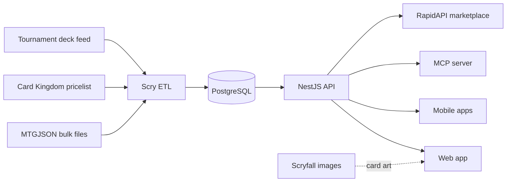
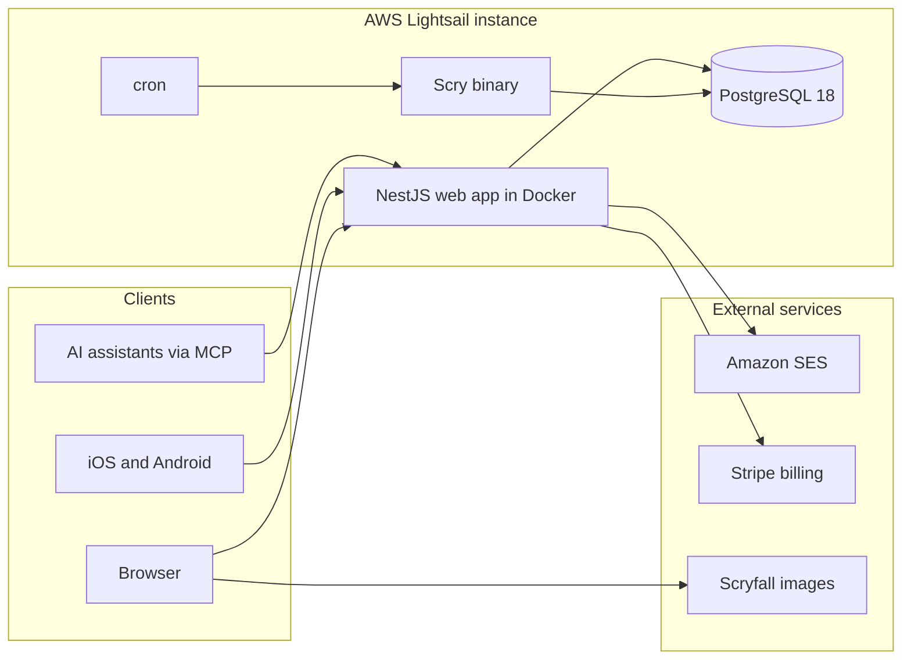
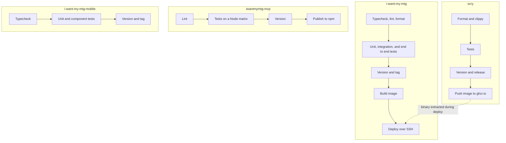

Magic cards are priced by a market that moves daily across tens of thousands of
printings. Tracking what a collection is worth means continuously pulling that
data, reconciling it against a catalog that changes with every set release, and
making it queryable fast enough to browse.

I Want My MTG is four repositories solving one problem. Scry pulls and
normalizes the data, PostgreSQL holds it, and three separate clients read from
it: a web app, mobile apps, and an MCP server that lets AI assistants query a
collection directly.

## How the data flows

Everything downstream depends on one ingestion path. Scry is the only writer of
card, price, and tournament data; every client is a reader.

Scry runs on a schedule rather than on demand. Prices refresh hourly, but only
after a check confirms the upstream file actually changed, so an unchanged feed
costs nothing. Tournament decks land nightly, and a weekly retention pass keeps
price history from growing without bound.

| Job | Schedule | What it does |
| --- | --- | --- |
| Ingest chain | Hourly | Refreshes prices when upstream data changed |
| Deck ingest | Nightly | Pulls the last two days of tournament decks |
| Retention | Weekly | Prunes price history |
| Health check | Daily | Verifies the pipeline is current |

## How it is deployed

The whole system runs on a single AWS Lightsail instance. The web app runs in
Docker, Scry runs as a native binary invoked by cron, and both talk to the same
PostgreSQL database.

The deployment order matters and is enforced rather than remembered. Scry writes
tables that the web repository's migrations create, so the web deploy runs
migrations first and only then installs the Scry binary, extracting it from the
published container image.

## How it ships

Each repository has its own pipeline, and two of them are coupled by that
deployment order.

Version numbers are derived from pull request titles rather than hand edited,
so a merge decides its own release number and the tag, image, and deployed
version cannot drift apart.
