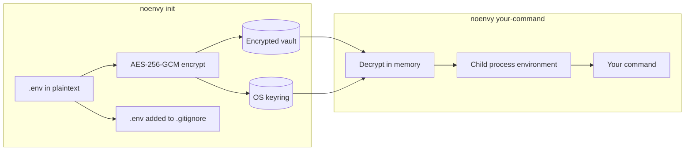
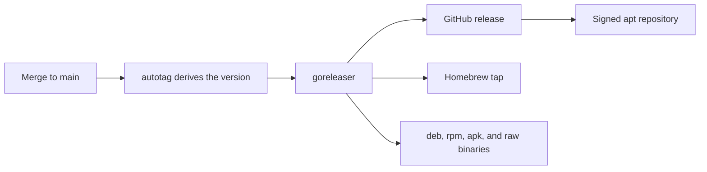

Local development secrets are handled badly almost everywhere. A `.env` file
sits in plaintext on disk, one `git add .` away from being published. The
alternatives each ask for something disproportionate: Doppler and Infisical are
team scale services that want an account and a network connection, 1Password
CLI wants a subscription, and `direnv` does not encrypt anything at all.

noenvy encrypts the `.env` into a vault, puts the key in the operating system
keyring, and injects the secrets into whatever command you run. Nothing sits in
plaintext on disk, there is no account, and there is no server.

```bash
noenvy init       # encrypts .env, stores the key in the keyring
noenvy npm start  # decrypts in memory, injects env vars, runs your command
```

## Running at the process boundary

The design decision the whole tool rests on: noenvy is not a library. It never
gets imported, so it works the same for Go, Python, Node, or anything else that
reads environment variables.

Language specific dotenv libraries load secrets into the process where every
transitive dependency can read them through `process.env` or `os.environ`.
noenvy hands the secrets to the child process it spawns and stays out of the
way.



## What is actually stored

Encryption is AES-256-GCM using Go's standard library, with a fresh nonce per
encryption from `crypto/rand`. GCM's authentication tag gives tamper detection
for free: change one byte of the vault and decryption fails rather than
returning garbage.

| Bytes | Contents |
| --- | --- |
| 0 | Format version |
| 1 to 12 | AES-GCM nonce |
| 13 onward | Ciphertext and the 16 byte authentication tag |

The key never touches disk. It lives in the platform credential store, keyed by
a project id derived from the SHA-256 of the project root's absolute path.
Project root detection walks upward looking for `.git`, `package.json`,
`Cargo.toml`, `go.mod`, or `pyproject.toml`, taking the innermost match so
monorepos resolve to the right project.

## Saying plainly what it does not do

A local secrets tool that oversells itself is worse than no tool, because
people calibrate their behavior to the claim. noenvy protects against plaintext
on disk, accidental commits, and casual access by processes not running as you.

It does not protect against a compromised user session, malicious code running
as your user, or memory inspection of the running child process. An attacker
with your login has your keyring. No local secrets tool solves that, and the
README says so before it says anything about features.

Platform support follows the same rule. The tool depends on an OS credential
store, so it works on macOS, Windows, and Linux desktops running a Secret
Service daemon, and it does not work on headless servers, containers, WSL2, or
devcontainers. Those are listed as unsupported rather than quietly failing.

## How it ships

One tagged release fans out to every packaging format, so installation
instructions never drift from what actually exists.



The apt repository is published to a GitHub Pages branch with GPG signed
metadata, so `apt` verifies every package end to end rather than trusting a
plain HTTP download.
